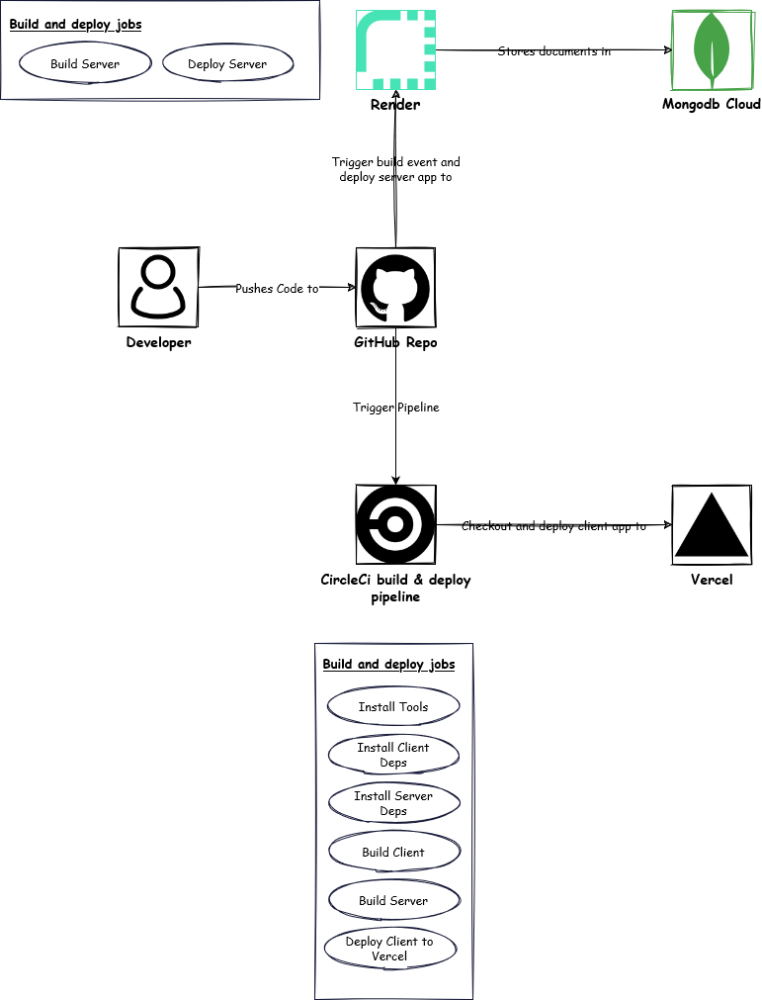

# Covid Tracker

A full stack application that allows user to check whether they might be infected with Covid-19 and display the infected
cases on a map.

## Tech Stack

- [React](https://reactjs.org/) - Single Page Application Framework
- [Auth0](https://auth0.com/) - Secure Authentication Management Service
- [Node](https://nodejs.org) - Javascript Runtime
- [Express](https://expressjs.com/) - Javascript API Framework
- [MongoDB](https://www.mongodb.com/) - NoSQL Database Management System
- [Vercel](https://vercel.com/) - Platform for Hosting Frontend Application
- [Render](https://render.com/) - Node.js Hosting Environment
- [MongoDB Cloud](https://cloud.mongodb.com) - Mongodb Hosting Environment

## System Architecture

## Project Dependencies

### Server

- [Express](https://expressjs.com/) - For creating node server
- [Mongoose](https://mongoosejs.com/) - For managing mongodb
- [winston](https://github.com/winstonjs/winston) - For logging

### Client

- [Tailwindcss](https://tailwindcss.com/) - For styling
- [Flowbite React](https://flowbite-react.com/) - For UI components styled in tailwindcss
- [React Simple Maps](https://www.react-simple-maps.io/) - For display data on maps
- [React Router](https://reactrouter.com/en/main) - For handling page routing

## Run Locally

### Running Server

1. Move into `server` directory and install dependencies `npm install`
2. Rename `.env.example` file to `.env` and provide values for each key. To get values for mongo keys, you need to
   create a database cluster on mongodb cloud.
3. Run `npm run dev` to start development server & `npm start` to start production server.

### Running Client

1. Move into `client` directory and install dependencies `npm install`
2. Rename `.env.example` file to `.env` and provide values for each key. To get values for `Auth0` keys, you have to create an application on `Auth0` with API managemnet.
3. Run `npm run dev` to start development server & `npm start` to start production server.

## Deployment and Pipeline Infrastructure

## API Documentation

See [apis documentation](./docs/apis.md) for more info.

## Screenshots

See [images/screenshots](./images/screenshots/) for application screenshots.

## Demo

https://user-images.githubusercontent.com/29373629/221850167-0a049318-41d0-430d-b1b4-65a447d412c4.mp4
